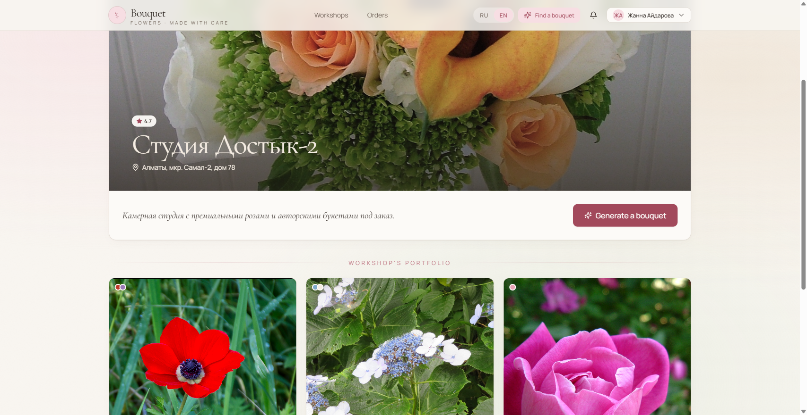
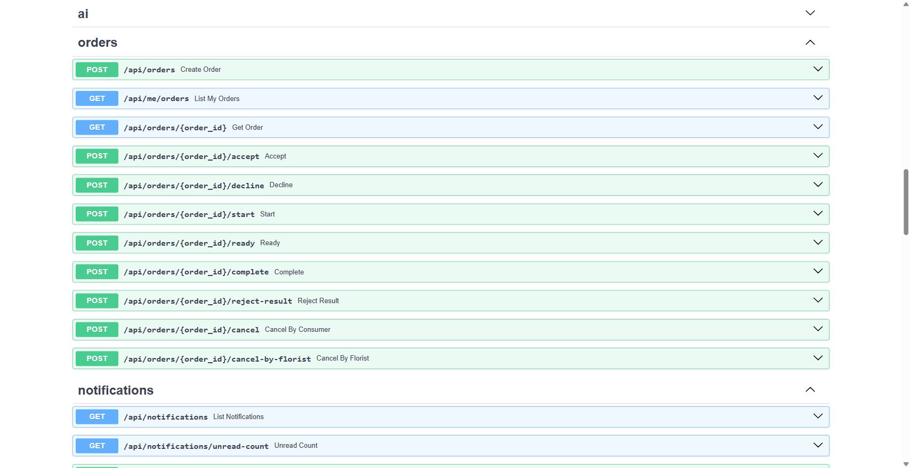
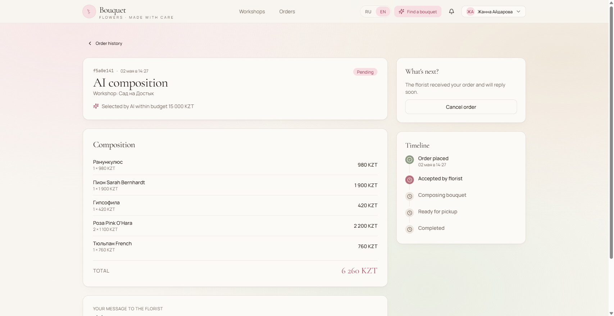

# Bouquet AI Platform

Local production-grade setup of a platform for AI-assisted bouquet ordering.

Stack: **FastAPI** (Python 3.12) + **PostgreSQL 16** + **React 18 / Vite** + optional integration with **ComfyUI** and an external **LLM** (OpenAI-compatible API).

[](https://www.youtube.com/watch?v=vUEDHcDIW40)
[](https://www.youtube.com/watch?v=GOu0d4LSTX8)

---

## NLP Final Exam Submission (Option 2 — Custom Project)

**Notebook:** [`notebooks/NLP_Final_BouquetAI.ipynb`](notebooks/NLP_Final_BouquetAI.ipynb)

**NLP Task:** Natural-language bouquet composition selection using Meta **Llama 3.1 8B** (via Ollama).  
**LLM Model:** `llama3.1:8b` — OpenAI-compatible API served by Ollama at `http://localhost:11434/v1`.  
**Evaluation:** 12 test cases (4 budgets × 3 Russian prompts) — budget compliance rate, JSON reliability (100% clean parse), response latency.

### Running Application Screenshots

| Frontend — Browse Workshops | Florist Point with AI Ordering |
|---|---|
|  |  |

| Swagger UI — API Docs | AI Generation Result |
|---|---|
|  |  |

---

## Quick Start

```bash
# 0. Clone repository
git clone <your-repo-url>
cd boquet
# 1. Install Docker Desktop / Docker Engine
# 2. Copy environment variables
cp .env.example .env
# 3. (optional) edit .env — JWT_SECRET, passwords, AI_PROVIDER
# 4. Bring up the full stack
make up
```

After startup:

| URL | Purpose |
|---|---|
| http://localhost:5173 | Frontend (Vite build served by nginx) |
| http://localhost:8000 | Backend API (FastAPI) |
| http://localhost:8000/docs | OpenAPI Swagger UI |
| postgres://localhost:5432 | Database (credentials from `.env`) |

The initial superadmin is created by seed values from `SUPERADMIN_EMAIL` / `SUPERADMIN_PASSWORD` (defaults: `admin@bouquet.local` / `admin12345`).

If you run backend without Docker, Python dependencies are also available in `backend/requirements.txt`.

---

## Makefile Commands

| Command | Description |
|---|---|
| `make up` | `docker compose up -d --build` — build and start full stack in background |
| `make down` | stop and remove containers (volumes remain) |
| `make build` | rebuild images without starting services |
| `make logs` | stream logs of all services (`Ctrl+C` to exit) |
| `make ps` | list running services and their status |
| `make migrate` | run Alembic migrations (`alembic upgrade head`) |
| `make seed` | load seed data (`python -m app.cli.seed`) |
| `make test` | run pytest inside backend container |
| `make shell` | open bash in running backend container |
| `make ollama-pull` | re-download `llama3.1:8b` model inside the ollama container |

All targets are wrappers around `docker compose ...`; you can run compose commands directly if needed.

---

## Docker Compose Services

| Service | Port | Description |
|---|---|---|
| `db` | 5432 | PostgreSQL 16 (alpine), data in named volume `db_data` |
| `migrations` | — | one-time `alembic upgrade head` after `db` healthcheck |
| `backend` | 8000 | FastAPI + Uvicorn, media in volume `media_data` |
| `seed` | — | one-time load of demo data and superadmin |
| `frontend` | 5173 -> 80 | Vite build served by nginx (see `frontend/nginx.conf`) |
| `ollama` | 11434 | Local Ollama server; auto-pulls `llama3.1:8b` on first start (~4.7 GB) |

Dependencies: `migrations` waits for healthy `db`; `backend` starts after successful `migrations`; `seed` starts after `backend`; `frontend` starts after `backend`.

---

## Environment Variables

The full list is in `.env.example`. Key groups:

**Postgres** — `POSTGRES_USER`, `POSTGRES_PASSWORD`, `POSTGRES_DB`, `POSTGRES_HOST=db`, `POSTGRES_PORT=5432`.

**Backend / Auth** — `JWT_SECRET` (must be changed), `JWT_ALGORITHM`, `ACCESS_TOKEN_TTL_MIN`, `REFRESH_TOKEN_TTL_DAYS`, `CORS_ORIGINS`, `MEDIA_DIR`, `MEDIA_BASE_URL`, `ENV`.

**Superadmin** — `SUPERADMIN_EMAIL`, `SUPERADMIN_PASSWORD` (used by seed on first startup).

**AI pipeline** — `AI_PROVIDER`: `mock` (default), `comfyui` (external LLM + ComfyUI), `ollama` (local Ollama llama3.1:8b + ComfyUI):
- `LLM_BASE_URL`, `LLM_API_KEY`, `LLM_MODEL`, `LLM_TIMEOUT_SEC` — LLM endpoint; for Ollama set `LLM_BASE_URL=http://ollama:11434/v1`, `LLM_MODEL=llama3.1:8b`;
- `COMFYUI_BASE_URL`, `COMFYUI_TIMEOUT_SEC`, `COMFYUI_POLL_INTERVAL_SEC` — ComfyUI instance (default `host.docker.internal:8188`).

**Frontend** — `VITE_API_BASE`: empty means same-origin (nginx proxy in Docker, Vite proxy in dev). Set only if frontend is hosted on a separate domain.

---

## Enabling Real AI Generation

By default `AI_PROVIDER=mock`, so backend returns mock responses. Two real-generation modes are available:

### Option A — Ollama (local, recommended for development)

Uses a local `llama3.1:8b` model served by the `ollama` docker-compose service. The model is downloaded automatically on first `make up` (~4.7 GB, be patient).

1. Run ComfyUI locally (see `ai/` and project instructions).
2. In `.env` set:
   ```
   AI_PROVIDER=ollama
   LLM_BASE_URL=http://ollama:11434/v1
   LLM_MODEL=llama3.1:8b
   LLM_TIMEOUT_SEC=120
   ```
3. Run `make down && make up`.
4. Wait for `ollama` container to finish pulling the model (`docker compose logs ollama -f`).
5. To re-pull the model manually: `make ollama-pull`.

### Option B — External OpenAI-compatible LLM (vLLM, LM Studio, etc.)

1. Run ComfyUI locally (see `ai/` and project instructions).
2. Start or get access to an OpenAI-compatible LLM endpoint.
3. Set `AI_PROVIDER=comfyui` in `.env`, fill in `LLM_*` and `COMFYUI_*`.
4. Run `make down && make up`.

Pipeline parameters (sampler, dimensions, variant budgets) are editable by superadmin in **Settings -> AI Config** (`/superadmin/ai-config`).

---

## Local Development Without Docker

**Backend** (Python 3.12):
```bash
cd backend
python -m venv .venv && source .venv/bin/activate   # or .venv\Scripts\activate in PowerShell
pip install -e ".[dev]"
# start Postgres separately (for example: docker compose up -d db)
alembic upgrade head
python -m app.cli.seed
uvicorn app.main:app --reload --port 8000
```

**Frontend** (Node 20+):
```bash
cd frontend
npm install
npm run dev          # http://localhost:5173, proxies /api to :8000
npm run build        # production build into dist/
npm run typecheck    # tsc -b --noEmit
```

**Backend tests:**
```bash
make test                                    # in Docker
# or locally:
cd backend && pytest -v
```

---

## Repository Structure

```
backend/        FastAPI: app/, alembic/, tests/, pyproject.toml, Dockerfile
frontend/       React + Vite: src/, public/, vite.config.ts, Dockerfile, nginx.conf
ai/             ComfyUI portable + workflow drivers and instructions
docs/           Specs and implementation plans (superpowers/specs, superpowers/plans)
docker-compose.yml
Makefile
.env.example
```

---
# boquet_project
